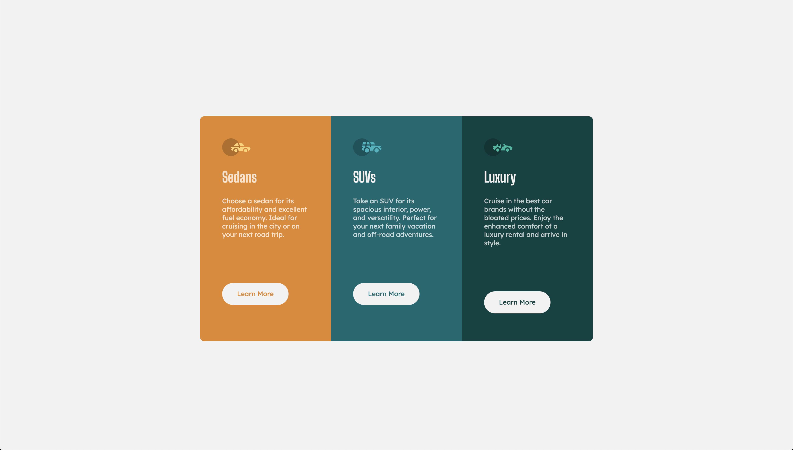

# Frontend Mentor - 3 column preview card component

This is a solution to the [3 column preview card component](https://www.frontendmentor.io/challenges/3column-preview-card-component-pH92eAR2-). Frontend Mentor challenges help you improve your coding skills by building realistic projects.

## Table of contents

- [Overview](#overview)
  - [The challenge](#the-challenge)
  - [Screenshot](#screenshot)
  - [Links](#links)

## Overview

### The challenge

Users should be able to:

- View the optimal layout depending on their device's screen size
- See hover states for interactive elements

### Screenshot

### Links

- Solution URL: [https://github.com/akpekig/3-column-preview-card-component/](https://github.com/akpekig/3-column-preview-card-component/)
- Live Site URL: [https://akpekig.github.io/3-column-preview-card-component/](https://akpekig.github.io/3-column-preview-card-component/)

### Built with

- Semantic HTML5 markup
- CSS custom properties
